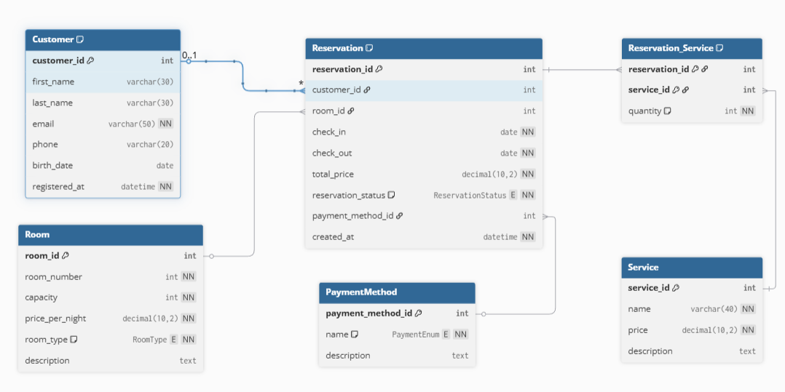

# **Hotelová Relační Databáze**

Krátký popis: Tato databáze je navržena pro hotelový rezervační systém. Umožňuje uchovávat informace o zákaznících, pokojích, rezervacích, službách a platebních metodách. Cílem je mít přehledný model pro správu rezervací a doplňkových služeb v hotelu.

- **dbdiagram:** https://dbdiagram.io/d/6916f7986735e11170cf60f5
- **Obrázek schématu:**

---

## **Popis databáze**

### **Customer**
Uchovává informace o zákaznících.  
- **Hlavní sloupce:**  
  - `customer_id` (PK)  
  - `first_name`, `last_name`  
  - `email` (UNIQUE)  
  - `phone` (UNIQUE)  
  - `birth_date`  
  - `registered_at`  

### **Room**
Uchovává informace o pokojích v hotelu.  
- **Hlavní sloupce:**  
  - `room_id` (PK)  
  - `room_number` (UNIQUE)  
  - `capacity`  
  - `price_per_night`  
  - `room_type` (ENUM: 'single', 'double', 'suite')  
  - `description`  

### **Reservation**
Uchovává informace o rezervacích provedených zákazníky.  
- **Hlavní sloupce:**  
  - `reservation_id` (PK)  
  - `customer_id` (FK → `Customer.customer_id`)  
  - `room_id` (FK → `Room.room_id`)  
  - `check_in`, `check_out`  
  - `total_price`  
  - `reservation_status` (ENUM: 'pending', 'confirmed', 'cancelled')  
  - `payment_method_id` (FK → `PaymentMethod.payment_method_id`)  
  - `created_at`  

### **Service**
Uchovává služby, které hotel nabízí (např. snídaně, wellness).  
- **Hlavní sloupce:**  
  - `service_id` (PK)  
  - `name`  
  - `price`  
  - `description`  

### **Reservation_Service**
Spojovací tabulka mezi rezervacemi a službami.  
- **Hlavní sloupce:**  
  - `reservation_id` (PK část, FK → `Reservation.reservation_id`)  
  - `service_id` (PK část, FK → `Service.service_id`)  
  - `quantity` (výchozí 1)  

### **PaymentMethod**
Uchovává typy plateb podporované hotelem.  
- **Hlavní sloupce:**  
  - `payment_method_id` (PK)  
  - `name` (ENUM: 'card', 'cash', 'transfer')  
  - `description`  

---

### **Indexy a omezení**
- **Customer:** unikátní indexy na `email` a `phone`.  
- **Reservation:** indexy na `check_in`, `check_out` a kombinaci `check_in + check_out`.  
- **Cizí klíče:**  
  - `Reservation.customer_id` → `Customer.customer_id`  
  - `Reservation.room_id` → `Room.room_id`  
  - `Reservation.payment_method_id` → `PaymentMethod.payment_method_id`  
  - `Reservation_Service.reservation_id` → `Reservation.reservation_id`  
  - `Reservation_Service.service_id` → `Service.service_id`  
